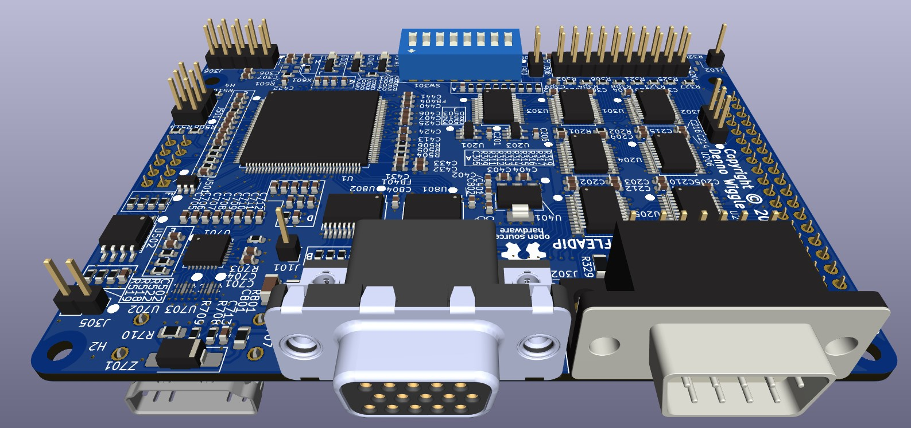

# FLEADiP
FLEADiP is a compatiable add-on board for the Z80 Retro! project.

## Description
This project is an FPGA Logic Engine And Display Processor add-on board that fits the form factor of the [Z80 Retro! project by John Winans](https://github.com/Z80-Retro).

It has VGA, HDMI, two Atari 2600 compatible joystick ports, and user I/O expansion pin headers. 

 board.

## Board design 
The board design is based around an Efinix Trion T20 FPGA in a QFP144 package. The HDMI output is driven by a PTN3366 IC that converts the LVDS from the FPGA into a true TMDS signal.

The VGA, HDMI, input header, and joystick ports are completely buffered to protect the FPGA. The user I/O port is unbuffered to give plenty of options for add-on creations.

The HDMI socket is on the back side of the board and allowance must be made for the type of board that is underneath. If there is not a good fit, a spacer board can be added.

## FPGA logic
The FPGA logic uses [Matthew Haggerty's F18A core](https://github.com/dnotq/f18a) so that code is compatible with the Z80 Retro! [2068-Z80-TMS9118 project board](https://github.com/Z80-Retro/2068-Z80-TMS9118). 

The HDMI logic on the FPGA uses the DVI code design from [Randi Rossi's VicII-Kawari project](https://github.com/randyrossi/vicii-kawari).

The FPGA image is stored on a 4MByte W25Q32JVSS Flash memory. There is both a SPI and JTAG programming header on the right side of the board. The board may be programmed using an FT232H module with the Efinix Efinity Progrrammer tool, or using another Z80 Retro! add on board, the - ESP32 Interface and Programmer with WiFi board (link coming) which was designed to fit below this one (no HDMI connector fit concerns).

# Z80 I/O Port Addresses
| I/O Address | Function |
|-------------|--------|
| 0x50        | FPGA adress register address |
| 0x51        | FPGA data registers (not all are writable)  |
| 0x80        |  Video Display Processor |
| 0x81        | Video Display Processor |
| 0xA8        | Joystick 0 (Z80 Retro! legacy address) |
| 0xA9        | Joystick 1 (Z80 Retro! legacy address) |

# FPGA Registers
Full details listed [in the VHDL code](fpga/src/wtm/wtm_z80Interface.vhd)
| Register Address  | Register Function | Read / Write |
|------------------|-------------------| ------------ |
| 0       | FPGA Version       | R |
| 1       | R/W Test Register  | R/W |
| 2       | PLL Lock           | R |
| 3       | Config switch      | R |
| 4       | Joystick 0         | R |
| 5       |  Joystick 1        | R |
| 6       |  HDMI control      | R/W |
| 6       |  Interrupt         | R |

