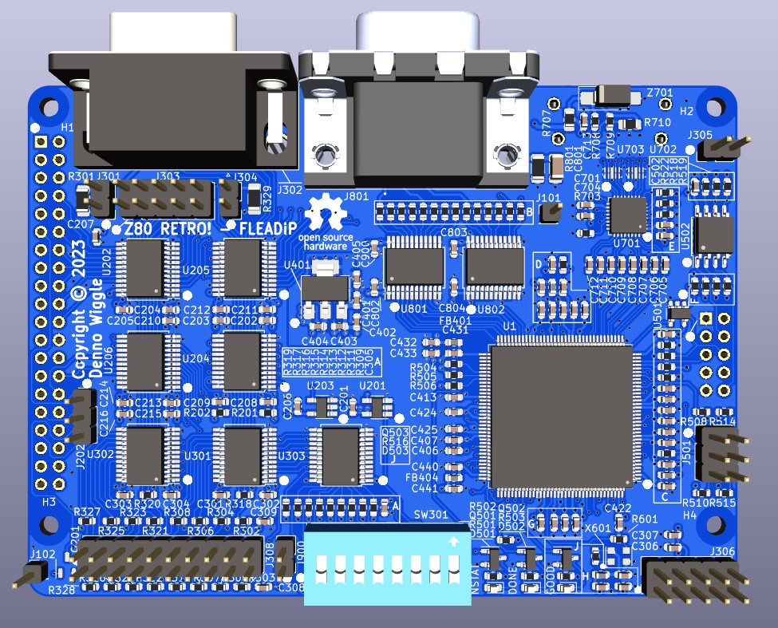

# FLEADiP
FLEADiP is a compatiable add-on board for the Z80 Retro! project

## Description
This project is an FPGA Logic Engine And Display Processor add-on board that fits the form factor of the [Z80 Retro! project by John Winans](https://github.com/Z80-Retro).

## Top View

## Bottom View

## FLEADiP Board Rev 0.0 Release Notes

1. The 'output' directory contains the BOM, netlist, and PDF schematic.

2. Board design used KiCad 7.0.2.

3. The HDMI connector is on the bottom side of the board so that there is no P/N signal swap, at least for rev 0 PCB. This means the card doesn't fit right above the Z80 Retro! CPU board unless a spacer board is added or the HDMI connector is not installed. The board was designed with the intent to use the ESP32 programmer board underneath FLEADiP which does have space for the connector.
   
   A future spin could move the HDMI connector to the top side, with swapping all P/N traces. This may work right away with no hdl code change, but if it does not the logic should be inverted in the HDL code to address this.
   
4. The silkscreen circle pin 1 marker for SW301, the 16 pin configuration switch is in the wrong position. The copper layout is fine, 
    - pin 1 is in the opposite corner to that marked - top right as viewed from the front board edge.

5. J503 2x5 right-angle programming connector should be installed on the top side of the board.
   - The silkscreen is marked on the back side, opposite to where the connector should be installed on.
   - The Bottom Side View image shows a vertical receptacle connector installed when it is in fact a right-angle header on the Top Side.

7. To program an image to the FPGA FLASH you can use a FT232H module with the Efinity FPGA SW tool programmer. 
   - I tested a $12 one from Amazon  https://www.amazon.com/dp/B09XTF7C1P:
   - Pin connections are as follows:

| Signal        |  FT232H Module Pin  | FLEADiP Location |
| ------------- | ------------------- | ---------------- |
| SPI_CLK       | AD1 | J503.2 |
| SPI_MOSI      | AD0 | J503.8 |
| SPI_MISO      | AD2 | J503.10 |
| SPI_CS_N      | AD3 | J503.4 |
| MOUSE_RESET_N | AD4 | J503.6 |
| MOUSE_CDONE   | AD5 | J503.5 |
| GND      | Module Specific | J503.9 |
  
7. Efinity Programmer tool settings
    - With the FT232H module the USB target should be USB <-> Serial Convertor
    - Active mode
    - Starting address 0x0
    - Check erase before programming
    - Check verify after programming
    - Uses a hex file image
  
8. The board can also be programmed with the "ESP32 Programmer and WiFi" Z80 Retro! add on board which offers console xmodem and web based upload options for programming files.

9. The second Joystick port uses a 10 pin header J303 and is designed for a 10pin header to female DB9 cable with a gender 
   changer added. That way it's just using another Z80 Retro! console cable with addition of DB9 gender changer rather than 
   a totally new cable.
    - To use a 2x5 header to male DB9 cable the wires on the header need to swap pin columns.
      This method was tested with cable https://www.amazon.com/dp/B0BGQ96LX5

10. 1x2 pin headers that supply 5V if a jumper is installed on the joystick ports should be no stuff for normal operation.
    - If you want to supply 5V on DB9 pin 5 then soldering a wire is preferred as clearances of 1x2 to 2x5 headers are tight for DB9 cables made with IDC headers and 2 pin headers with jumpers installed.
    - To use a 2x5 cable with 1x2 jumpers installed use a 2x5 to DB9 cable with a narrow 2x5 receptacle. 
    - J301, J305 = no stuff for normal use.

11. The second joystick fire/button2 and 5V options are wired per MSX joystick form factor. 
     - Do not plug another type of 2 button joystick such as for C64 or Atari 
       especially if 5V is expected on a pin other than pin 5.
     - One button Atari 2600 compatible joysticks are supported.

12. The schematic design and BOM uses a T20QFP144 device with C3 timing. It is recommended to switch to a C4 part as it has significantly more timing margin in the logic design. DigiKey part number is 2134-T20Q144C4-ND. An I4 device is also a good choice .

